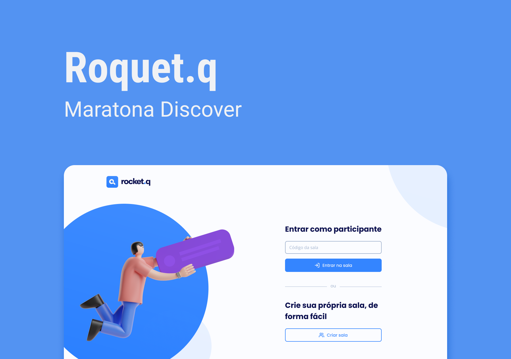

<p align="center">
  

  

  <a href="https://www.twitter.com/lucaswalder_dev/">
    
  </a>
  
  <a href="https://github.com/lucaswalder/rocketq/commits/master">
    
  </a>
    
   
   <a href="https://github.com/lucaswalder/rocketq/stargazers">
    
  </a>

  
 
</p>
<h1 align="center">
    
</h1>

<h4 align="center"> 
	🚧  Rocket.Q Concluído 🚀 🚧
</h4>

<p align="center">
 <a href="#-sobre-o-projeto">Sobre</a> •
 <a href="#-funcionalidades">Funcionalidades</a> •
 <a href="#-layout">Layout</a> • 
 <a href="#-como-executar-o-projeto">Como executar</a> • 
 <a href="#-tecnologias">Tecnologias</a> • 
 <a href="#-contribuidores">Contribuidores</a> • 
 <a href="#-autor">Autor</a> • 
 <a href="#user-content--licença">Licença</a>
</p>


## 💻 Sobre o projeto

RocketQ - Tem como objetivo criar salas para perguntas anônimas para tirar dúvidas das pessoas em assuntos variados. 


Projeto desenvolvido durante a **NLW 6 - Next Level Week** oferecida pela [Rocketseat](https://rocketseat.com.br).

O NLW é uma experiência online com muito conteúdo prático, desafios e hacks onde o conteúdo fica disponível durante uma semana.

---

## ⚙️ Funcionalidades

- [x] Qualquer pessoa pode criar uma sala ou entrar em uma existente para:
  - [x] Fazer perguntas anônimas
  - [x] Responder as perguntas feitas
  - [x] é preciso ter o código da sala para entra
- [x] Os usuários com a senha da sala podem:
  - [x] deletar perguntas feitas
  - [x] marcar como lidas

---

## 🎨 Layout

O layout da aplicação está disponível no Figma:

<a href="https://www.figma.com/file/vp3iFfd1ohCbHyDX9jCiQi/Roquet.q">
  
</a>

### Web

<p align="center" style="display: flex; align-items: flex-start; justify-content: center;">
  

---

## 🚀 Como executar o projeto

Este projeto é divido em duas partes:
1. Backend (pasta controllers)
2. Frontend (pasta views)

💡O Frontend precisa que o Backend esteja sendo executado para funcionar.

### Pré-requisitos

Antes de começar, você vai precisar ter instalado em sua máquina as seguintes ferramentas:
[Git](https://git-scm.com), [Node.js](https://nodejs.org/en/). 
Além disto é bom ter um editor para trabalhar com o código como [VSCode](https://code.visualstudio.com/)

#### 🎲 Rodando o Backend (servidor)

```bash

# Clone este repositório
$ git clone git@github.com:lucaswalder/rocketq.git

# Acesse a pasta do projeto no terminal/cmd
$ cd README-NLW6_rocketq

# Instale as dependências
$ npm install

# Execute a aplicação em modo de desenvolvimento
$ npm start

# O servidor inciará na porta:3333 - acesse http://localhost:3333 

```

#### 🧭 Rodando a aplicação web (Frontend)

```bash

# A aplicação será aberta na porta:3000 - acesse http://localhost:3000

```

---

## 🛠 Tecnologias

As seguintes tecnologias  foram usadas na construção do projeto:
 

-   **[HTML](https://developer.mozilla.org/pt-BR/docs/Web/HTML)**
-   **[CSS](https://developer.mozilla.org/pt-BR/docs/Web/CS)**
-   **[JavaScript](https://developer.mozilla.org/pt-BR/docs/Web/JavaScript)**
-   **[NodeJS](https://nodejs.org/en/)**
-   **[Express](https://expressjs.com/)**
-   **[EJS](https://ejs.co/)**
-   **[SQLite](https://github.com/mapbox/node-sqlite3)**


---

## 👨‍💻 Contribuidores

💜 Um super thanks 👏 para a educadora da @rocketseat [Jakeliny Gracielle](https://github.com/jakeliny) que teve todo o cuidado e carinho de ensinar a implementação desse projeto maravilhoso :)

## 💪 Como contribuir para o projeto

1. Faça um **fork** do projeto.
2. Crie uma nova branch com as suas alterações: `git checkout -b my-feature`
3. Salve as alterações e crie uma mensagem de commit contando o que você fez: `git commit -m "feature: My new feature"`
4. Envie as suas alterações: `git push origin my-feature`

---

## 🦸 Autor

<a href="https://lucaswalder.dev">
 
 <br />
 <sub><b>Lucas Walder</b></sub></a> <a href="https://lucaswalder.dev/" title="Lucas Walder's Site">🚀</a>
 <br />

[](https://twitter.com/lucaswalder_dev) [](https://www.linkedin.com/in/lucaswalder-dev/) 
[](mailto:contato@lucaswalder.dev)

---

## 📝 Licença

Este projeto esta sobe a licença [MIT](./LICENSE).

Feito com ❤️ por Lucas Walder 👋🏽 [Entre em contato!](https://www.linkedin.com/in/lucaswalder-dev/)

